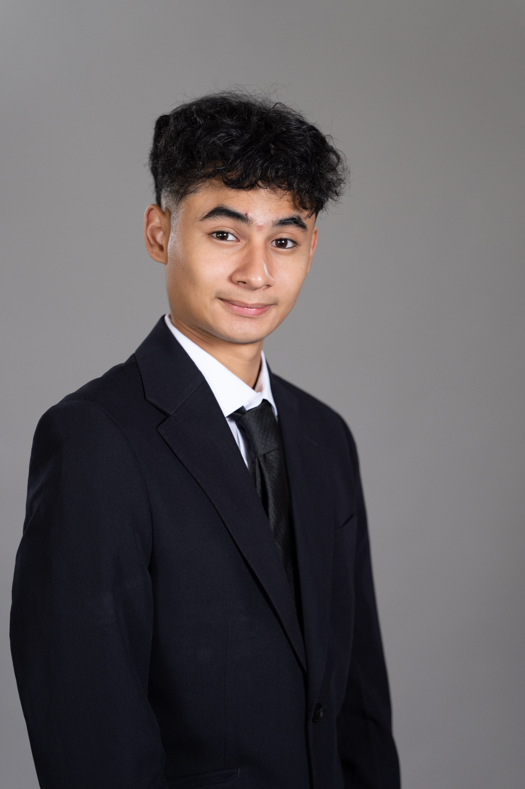

Cyber Tralala - WRO Future Engineers 2025
====

We are Cesar Escarra, Diego Concepcion and Christopher Vazquez. We are students from Thomas Jefferson School Of Panama and we are the members of the team Cyber Tralala that competes in the WRO 2025 Future Engineers Category. In this Repository, we share all the information of our project.  

Somos Cesar Escarra, Diego Concepcion y Christopher Vazquez. Somos estudiantes del Thomas Jefferson School y conformamos el equipo Cyber Tralala que participa en la categoria de futuros ingenieros de la WRO. En este repositorio compartimos toda la informacion de nuestro proyecto.  

## Project summary / Resumen del proyecto
  
Tralalerito is our self-driving car built for the WRO 2025 Future Engineers category. Our goal is to design a small, reliable robot that can navigate the Open Course and the Obstacle Course without any human control.  

Tralalerito es nuestro carro autónomo para la categoría Futuros Ingenieros de WRO 2025. Nuestro objetivo es diseñar un robot pequeño y confiable que pueda completar el Desafio Abierto y el Desafio de Obstaculos sin control humano.  

  

The robot uses a mix of simple sensors and a camera to “see” walls and colored signs on the field. It decides which way to turn and how to move using a program we created.  

We focused on making our car robust, simple and easy to maintain so it can handle the challenges during competition.  

El robot usa una combinación de sensores simples y una cámara para “ver” las paredes y las señales de colores en el campo. Con esa información, toma decisiones sobre cómo girar y avanzar usando un programa creado por nosotros.  

Nos enfocamos en que nuestro carro fuera resistente, simple y fácil de mantener para poder afrontar los retos durante la competencia.  

## Table of Content/ Tabla de Contenido 

* `t-photos` contains  photos of the team - Contiene las fotos de nuestro equipo.
* `v-photos` contains photos of the vehicle - Contiene las fotos de nuestro vehiculo.
* `video` contains the video.md file with the link to a video where driving demonstration exists - Contiene los archivos con links a videos de youtube con el funcionamiento del robot.
* `schemes` contains one schematic diagrams in form of PNG and Fritzing of the electromechanical components illustrating all the elements (electronic components and motors) used in the vehicle and how they connect to each other - Contiene un diagrama electromecanico en formato PNG y Fritzing ilustrando todos los componentes usados en el vehiculo y sus debidas conexiones.
* `src` contains code of control software for all components which were programmed to participate in the competition - Contiene la programación usada en nuestro vehiculo para participar en la competencia.
* `models` is for the files for models used by 3D printers produce the vehicle elements - Contiene los modelos 3D utilizados para imprimir piezas para nuestro vehiculo.
* `other` is for other files which can be used to understand how to prepare the vehicle for the competition. It includes datasets, hardware specifications, communication protocols descriptions, links for buying, etc - Contiene especificaciones de hardware, protocolos de comunicacion, links de compra y otros.

 ## Team Members / Miembros del Equipo  

|  |   |   |
|:------------------------------:|:------------------------------:|:------------------------------:|
| **Diego Concepción** 17 years old | **Cesar Escarra** 18 years old | **Christopher Vasquez** 18 years old |

   
## Robot construction info / informacion sobre la construccion y funcionamiento del robot

Mobility management / Manejo de movilidad

We decided to use a rear-wheel drive remote control car as the basis for our project. A remote control car provides a fairly resistant chassis in addition to bringing 6v motors for movement and direction, allowing us high speed if necessary. The steering of our car consists of a direct current motor which operates a rack and pinion system to give direction to the front axle.The traction system consist on a simple axle with a gear that is attached to the pinion of the motor. Many cuts were made to the original chassis to be able to remove the original circuits and place our circuits. We also desgined and printed 3D mounts for our sensors and camera. On top of that, we designed and printed a Cybertruck body to give protection to the internal parts and electronics.
  
Decidimos usar como base para proyecto un carro a control remoto de traccion trasera. Un carro a control remoto nos da un chasis resistente, adicional de tener el sistema de traccion y direccion con los motores de 6v necesarios para ello, y nos permite usar el auto a altas velocidades si es necesario. La direccion de nuestro vehiculo consiste en un motor de corriente continua que opera un sistema de cremallera y piñon que dan el giro a los ejes delanteros. El sistema de traccion consiste en un eje solido conectado a las 2 ruedas traseras y a un engranaje que recibe el movimiento de el piñon del motor trasero. Le hicimos diversas modificaciones al chasis para poder quitar los controladores y circuitos originales y hacer espacio para colocar los nuestros. Le añadimos soportes impresos en 3D al chasis para poder colocar nuestros sensores y nuestra camara. Adicionalmente, diseñamos e imprimimos en 3D una carroceria de Cybertruck para cubrir y proteger los componentes electronicos y demas componentes internos del vehiculo.

Power and management / Manejo de potencia electrica

For this project we decided to eliminate the car's original power source which was AA batteries and use 2 18650 lithium ion batteries connected in series because they have a much greater discharge capacity than AA batteries, in addition to having more capacity and more voltage (3.7V each one, making a total of 7.4V in series). These batteries are widely used from flashlights to electric vehicles, this way we ensure that it is easy to get chargers and spare parts.

Para este proyecto decidimos eliminar la fuente de poder original del auto que eran 2 baterias AA, y usamos 2 baterias 18650 de iones de litio conectados en serie, porque tiene una capacidad de descarga mucho mayor, aparte de tener una mayor capacidad y un mayor voltaje (3.7V cada una, totalizando 7.4V en serie). Estas baterias son ampliamente usadas, desde en linternas como en vehiculos electricos, asi nos aseguramos que podemos conseguir facilmente cargadores y repuestos.

Obstacle and sense management / Manejo de vision y obstaculos

For this project we decided to use hc-sr04 ultrasonic sensors because they are cheap, easy to obtain and have fairly low consumption. We are using two sensors, one on each side, to detect the distance to the walls on the sides so that we can make corner turns and stay without crashing in the open challenge. In the case of the obstacle challenge, the sensors still play a secondary role in helping to turn and prevent the car from crashing into walls.

For obstacle management we decided to use a Huskylens camera. This camera is very intuitive to use and has artificial intelligence which helps with detection, in this case of colors. The camera provides very good integration with the Microbit platform in addition to the ability to program new colors in just seconds.

Para ese proyecto decidimos utilizar sensores ultrasonicos HC-SR04 porque son baratos, facil de obtener y tienen un consumo muy bajo. Estamos utilizando dos sensores, uno en el lado izquierdo y el otro en el derecho para obtener la distancia hasta las paredes laterales y poder tomar las curvas sin chocar en el desafio abierto. En el caso del desafio de obstaculos, los sensores igual toman un rol secundario en ayudar a girar y prevenir que el vehiculo choque.  

Para detectar los obstaculos, decidimos utilizar una camara Huskylens. Seleccionamos esta camara porque es muy intuitiva y tiene integrada una inteligencia artificial que ayuda con la deteteccion, en este caso de los colores. La camara tiene una muy buena integracion con la prataforma de microbit y tiene la capacidad de aprender colores en segundos.  
  
Open Challenge Programming / Programacion Desafio Abierto

To program the open circuit, we use simple programming based on the two ultrasonic sensors. First, the ultrasonic variable and the elapsed time in the loop are established to have a constant reading, a conditional is placed to activate the H-bridge so that the rear motor goes forward with a constant speed until the elapsed time is the equivalent to 3 turns, where it stops moving. Now we place a condition, If our sensor detects a distance greater than 1.5 meters to one side, this means that the car must be turned to that side by activating the H-bridge corresponding to that direction of the front motor. Afterwards, if the sensors detect a distance greater than 30 cm on each side (which means that it is in the center) the car will advance straight, otherwise, the car will look for which of the two sides the measurement is less than 30cm to turn in the other direction and rectify.  

Para el circuito sin obstaculos, utilizamos una programacion simple basada en los dos sensores ultrasonicos. Primero, las variables de las distancias y el tiempo transcurrido se establecen en el bucle para tener una medicion constante. Colocamos una condicional para activar el Puente-H para que el motor avance con una velocidad constante hasta que el tiempo transcurrido corresponda al de las 3 vueltas, donde se detiene. Ahora colocamos una condicional, si nuestros sensores miden una distancia mayor a 1.5 metros en un lado, el vehiculo se mueve en esa direccion activando el puente H y por consecuencia el motor para que la direccion gire al lado adecuado. Despues, si los sensores miden una distancia mayor a 30cm en ambos lados (Esto significa que el robot esta en el centro) el carro avanzara recto, sino, el carro va a determinar de que lado la distancia es menor a 30cm para girar en la otra direccion y rectificar.

Programming challenge obstacles / Programacion desafio de obstaculos

To begin, we first activate the huskylens in I2C protocol to communicate with the microbit and place it in color detection mode. In addition, we start with the rear motor at a slightly higher power controlled by pwm to have inertia when starting.

In the loop, we place all the ultrasonic sensor variables and the huskylens sampling, then we place the rear motor at a lower power and set the conditionals for the huskylens color detection. When it detects “ID1” corresponding to red, it turns to the right until it disappears from the field of view that we established by coordinates, the same with green “ID2” in the other direction. Finally, we put the same ultrasonic distance detection program that we used in the open challenge.

Para comenzar, en el bloque de inicio activamos el protocolo I2C de la huskylens para que se comunique con el microbit y se programe en modo de deteccion de color. Adicionalmente, colocamos el motor trasero a una potencia mayor para tener mas inercia al iniciar.  

En el bucle, colocamos las variables de las distancias medidas por los sensores y el muestreo de la huskylens, despues colocamos el motor trasero a una potencia menor y colocamos las condicionales para la deteccion de colores de la huskylens. Cuando la Camara detecta el ID1 correspondiente al color rojo, el vehiculo dobla hacia la derecha hasta que desaparece el ID de el campo de vision que establecemos con coordenadas, lo mismo pasa con el verde o ID2 en la otra direccion. Finalmente, despues de las condicionales de los obstaculos utilizamos el mismo codigo que en el desafio abierto.  

